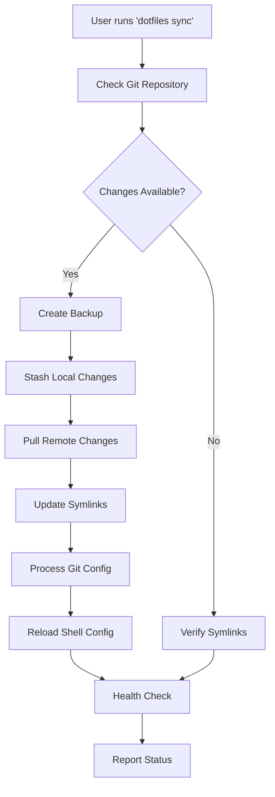
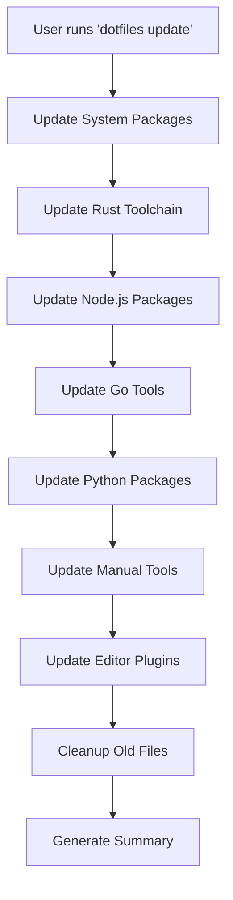
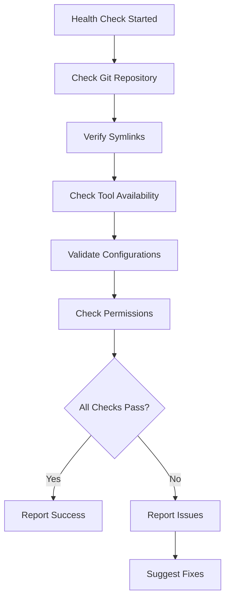

# 🏗️ System Architecture Guide

This document provides a comprehensive technical overview of how the self-maintaining dotfiles system works under the hood.

## 📋 Table of Contents

- [System Overview](#-system-overview)
- [Core Components](#-core-components)
- [Automation Architecture](#-automation-architecture)
- [Data Flow](#-data-flow)
- [Security Model](#-security-model)
- [Error Handling](#-error-handling)
- [Performance Considerations](#-performance-considerations)
- [Extension Points](#-extension-points)

## 🎯 System Overview

The dotfiles system is designed as a **self-maintaining infrastructure** that operates on these principles:

### Design Principles
1. **Automation First**: Minimize manual intervention
2. **Fail-Safe**: Always backup before changes
3. **Idempotent**: Safe to run multiple times
4. **Observable**: Comprehensive logging and status
5. **Recoverable**: Easy rollback and restoration
6. **Cross-Platform**: Works on macOS, Linux, WSL

### Architecture Patterns
- **Command Pattern**: Unified CLI interface
- **State Management**: Track system state and changes
- **Observer Pattern**: Health monitoring and alerts
- **Template Method**: Consistent operation flows
- **Strategy Pattern**: Platform-specific implementations

## 🔧 Core Components

### 1. Command Line Interface (`dotfiles.sh`)

**Purpose**: Single entry point for all operations

**Key Features**:
- Unified command interface (`dotfiles <command>`)
- Help system and documentation
- Command routing and validation
- Status reporting and monitoring

**Architecture**:
```bash
dotfiles.sh
├── Command Parser
├── Help System  
├── Status Reporter
├── Command Router
└── Error Handler
```

**Commands Mapping**:
```bash
dotfiles sync    → scripts/dotfiles-sync.sh
dotfiles update  → scripts/auto-update.sh
dotfiles install → scripts/install-system.sh
dotfiles health  → dotfiles-sync.sh --health-check-only
dotfiles status  → Internal status function
```

### 2. Synchronization Engine (`dotfiles-sync.sh`)

**Purpose**: Manage repository updates and configuration synchronization

**Core Functions**:
- Repository update management
- Configuration file synchronization
- Symlink creation and maintenance
- Backup management
- Health checking

**Flow Diagram**:
```
┌─────────────┐    ┌──────────────┐    ┌─────────────┐
│   Check     │───▶│   Backup     │───▶│   Update    │
│   Git Repo  │    │   Configs    │    │   Repository│
└─────────────┘    └──────────────┘    └─────────────┘
        │                                      │
        ▼                                      ▼
┌─────────────┐    ┌──────────────┐    ┌─────────────┐
│   Health    │◀───│   Reload     │◀───│   Create    │
│   Check     │    │   Shell      │    │   Symlinks  │
└─────────────┘    └──────────────┘    └─────────────┘
```

**Configuration Management**:
```bash
# Symlink mapping structure
DOTFILES_MAP=(
    ["source/path"]="target/path"
    ["config/bash/bashrc"]="$HOME/.bashrc"
    ["config/fish/config.fish"]="$HOME/.config/fish/config.fish"
    # ... more mappings
)
```

### 3. Update Engine (`auto-update.sh`)

**Purpose**: Automated tool and package management

**Update Categories**:
- **System Packages**: OS package manager updates
- **Development Tools**: Language-specific toolchains
- **Manual Installations**: GitHub releases and direct downloads
- **Editor Plugins**: Neovim, VS Code extensions

**Update Flow**:
```
System Updates ──┐
                 │
Language Tools ──┼─→ Update Manager ──→ Cleanup ──→ Log Results
                 │
Manual Tools ────┘
```

**Tool Update Strategies**:
| Tool Category | Update Method | Frequency |
|---------------|---------------|-----------|
| System Packages | `apt`/`brew`/`pacman` | Daily |
| Rust Toolchain | `rustup update` | Daily |
| Node.js | `npm update -g` | Daily |
| Go Tools | `go install <tool>@latest` | Daily |
| Manual Tools | GitHub API + wget | Daily |

### 4. Installation System (`install-system.sh`)

**Purpose**: Bootstrap new systems with full dotfiles setup

**Installation Phases**:
1. **Detection**: Identify platform and package manager
2. **Package Installation**: Install tools via detected package manager
3. **Manual Installation**: Install tools not in package repositories
4. **Configuration**: Setup symlinks and shell integration
5. **Automation**: Enable automated maintenance

**Package Manager Detection**:
```bash
# Priority order for auto-detection
if command -v brew >/dev/null 2>&1; then
    method="brew"        # macOS Homebrew
elif command -v apt >/dev/null 2>&1; then
    method="apt"         # Ubuntu/Debian
elif command -v pacman >/dev/null 2>&1; then
    method="pacman"      # Arch Linux
else
    method="generic"     # Fallback method
fi
```

### 5. Symlink Manager (`create-symlinks.sh`)

**Purpose**: Manage configuration file symlinks

**Operations**:
- Create new symlinks
- Verify existing symlinks
- Repair broken symlinks
- Remove invalid symlinks

**Symlink Strategy**:
```bash
# Safe symlink creation process
1. Check if source exists
2. Create target directory if needed
3. Backup existing target file
4. Remove existing target
5. Create new symlink
6. Verify symlink integrity
```

## 🤖 Automation Architecture

### Cron Integration

**Scheduling Strategy**:
```bash
# Daily tool updates (lightweight)
0 9 * * * ~/.dotfiles/scripts/auto-update.sh --skip-system

# Weekly configuration sync (comprehensive)
0 10 * * 0 ~/.dotfiles/scripts/dotfiles-sync.sh

# Monthly full maintenance (complete)
0 11 1 * * ~/.dotfiles/scripts/auto-update.sh
```

**Automation Levels**:
1. **Level 1 - Daily**: Tool updates, plugin updates, cleanup
2. **Level 2 - Weekly**: Repository sync, configuration updates
3. **Level 3 - Monthly**: Full system update, comprehensive cleanup

### State Management

**State Storage**:
- **Log Files**: `~/.dotfiles-update.log` - Operation history
- **Backup Directory**: `~/.dotfiles-backups/` - Configuration snapshots
- **Git Repository**: `.git/` - Version control state
- **Symlink Registry**: Runtime verification of symlink status

**State Transitions**:
```
Initial State ──→ Update Available ──→ Backup Created ──→ Update Applied ──→ Verified
     ▲                                                                        │
     └────────────────────── Rollback (if needed) ◀─────────────────────────┘
```

## 🔄 Data Flow

### Sync Operation Flow



### Update Operation Flow



### Health Check Flow



## 🔒 Security Model

### Permission Management

**Script Permissions**:
```bash
# All scripts should be executable by owner only
chmod 755 scripts/*.sh

# Config files should be readable by owner only
chmod 644 config/**/*
```

**Sudo Usage**:
- **System Package Installation**: Requires sudo for `apt`/`pacman`
- **Manual Tool Installation**: Requires sudo for `/usr/local/bin`
- **File Operations**: Never requires sudo (operates in user space)

### Backup Security

**Backup Strategy**:
- Create timestamped backups before any changes
- Store backups in user home directory (`~/.dotfiles-backups/`)
- Keep maximum of 5 recent backups (auto-cleanup)
- Never backup sensitive files (credentials, private keys)

**Sensitive File Handling**:
```bash
# Files to exclude from backup/sync
SENSITIVE_PATTERNS=(
    "*.key"
    "*.pem" 
    "*_rsa"
    "*_ed25519"
    ".ssh/id_*"
    ".gnupg/*"
)
```

### Network Security

**Download Verification**:
- Use HTTPS for all downloads
- Verify GitHub releases via API
- Use official installation scripts when available
- Avoid piping curl directly to shell

**Example Secure Download**:
```bash
# Secure download pattern
DOWNLOAD_URL=$(curl -s https://api.github.com/repos/user/repo/releases/latest | jq -r '.assets[0].browser_download_url')
wget -O /tmp/tool.tar.gz "$DOWNLOAD_URL"
# Verify checksum if available
sha256sum -c tool.tar.gz.sha256
```

## 🚨 Error Handling

### Error Categories

1. **Network Errors**: Failed downloads, repository access
2. **Permission Errors**: Insufficient permissions for operations
3. **Dependency Errors**: Missing tools or libraries
4. **Configuration Errors**: Invalid or corrupt config files
5. **System Errors**: Disk space, system incompatibility

### Error Recovery Strategies

**Automatic Recovery**:
```bash
# Retry mechanism for network operations
retry_count=0
max_retries=3

while [[ $retry_count -lt $max_retries ]]; do
    if curl -sSL "$URL" -o "$FILE"; then
        break
    else
        ((retry_count++))
        log_warn "Download failed, retrying ($retry_count/$max_retries)..."
        sleep $((retry_count * 2))
    fi
done
```

**Fallback Mechanisms**:
- **Package Manager Fallback**: apt → snap → manual install
- **Configuration Fallback**: Custom config → default config
- **Tool Fallback**: Modern tool → traditional tool (e.g., `exa` → `ls`)

### Logging Strategy

**Log Levels**:
- **INFO**: Normal operations and status updates
- **WARN**: Non-critical issues that should be noted
- **ERROR**: Critical failures that prevent operation
- **SUCCESS**: Successful completion of operations

**Log Format**:
```bash
[TIMESTAMP] LEVEL: MESSAGE
[2024-06-30 14:30:45] INFO: Starting dotfiles sync
[2024-06-30 14:30:46] SUCCESS: Repository updated successfully
[2024-06-30 14:30:47] WARN: Missing configuration file: ~/.tmux.conf
```

## ⚡ Performance Considerations

### Optimization Strategies

**Parallel Execution**:
```bash
# Update multiple tools simultaneously
update_rust &
update_nodejs & 
update_python &
wait  # Wait for all background jobs
```

**Caching**:
- **Package Manager Cache**: Leverage system package cache
- **Git Repository**: Use shallow clones when appropriate
- **Download Cache**: Cache GitHub release information

**Minimal Operations**:
- Only update when changes are detected
- Skip unnecessary operations (e.g., if already up-to-date)
- Use incremental updates where possible

### Resource Management

**Disk Space**:
- Monitor backup directory size
- Automatic cleanup of old backups
- Temporary file cleanup after operations

**Network Usage**:
- Batch network operations
- Use compression when available
- Avoid unnecessary downloads

**CPU Usage**:
- Limit parallel processes to CPU count
- Use nice levels for background operations
- Avoid intensive operations during peak hours

## 🔌 Extension Points

### Adding New Tools

**To add a new tool to auto-update**:
1. Add to package lists in `install-system.sh`
2. Add update logic in `auto-update.sh`
3. Add health check in `dotfiles-sync.sh`

**Example**:
```bash
# In install-system.sh
MODERN_CLI_PACKAGES+=(
    "my-new-tool"
)

# In auto-update.sh
update_my_tool() {
    if command -v my-tool >/dev/null 2>&1; then
        log_info "Updating my-tool..."
        my-tool --self-update
        log_success "My-tool updated"
    fi
}
```

### Adding New Configurations

**To add new configuration symlinks**:
1. Add to `SYMLINK_MAP` in `create-symlinks.sh`
2. Add to `DOTFILES_MAP` in `dotfiles-sync.sh`

**Example**:
```bash
# Add new configuration mapping
["config/my-app/config.yml"]="$HOME/.config/my-app/config.yml"
```

### Custom Automation Scripts

**To add custom automation**:
1. Create script in `scripts/` directory
2. Make it executable: `chmod +x scripts/my-script.sh`
3. Add to cron via `dotfiles schedule` or manually

**Script Template**:
```bash
#!/usr/bin/env bash
# Custom automation script

set -euo pipefail

SCRIPT_DIR="$(cd "$(dirname "${BASH_SOURCE[0]}")" && pwd)"
DOTFILES_ROOT="$(dirname "$SCRIPT_DIR")"

# Include common functions
source "$SCRIPT_DIR/common.sh"

main() {
    log_info "Starting custom automation..."
    # Your custom logic here
    log_success "Custom automation completed"
}

if [[ "${BASH_SOURCE[0]}" == "${0}" ]]; then
    main "$@"
fi
```

### Platform-Specific Extensions

**To add platform-specific functionality**:
1. Check platform in scripts: `uname -s`
2. Use conditional logic for platform differences
3. Add platform-specific package lists

**Example**:
```bash
case "$(uname -s)" in
    Darwin*)
        # macOS-specific logic
        brew install my-mac-tool
        ;;
    Linux*)
        # Linux-specific logic
        sudo apt install my-linux-tool
        ;;
    CYGWIN*|MINGW*|MSYS*)
        # Windows-specific logic
        choco install my-windows-tool
        ;;
esac
```

## 📊 Monitoring and Observability

### Metrics Collection

**System Metrics**:
- Update frequency and success rate
- Tool installation status
- Configuration sync status
- Error rates by category

**Health Metrics**:
- Symlink integrity percentage
- Tool availability percentage
- Repository status (commits behind, conflicts)
- Backup freshness and count

### Status Reporting

**Status Dashboard** (`dotfiles status`):
```bash
📊 Dotfiles Status
Repository: ✅ Up to date (main branch)
Tools: ✅ 15/15 available
Configs: ✅ All symlinks valid
Backups: ✅ 3 available (latest: 2h ago)
Health: ✅ All checks passed
Last Update: ✅ 6h ago (automated)
Next Update: 🕐 In 18h (daily schedule)
```

This architecture ensures a robust, maintainable, and extensible dotfiles system that can evolve with your needs while maintaining reliability and security.